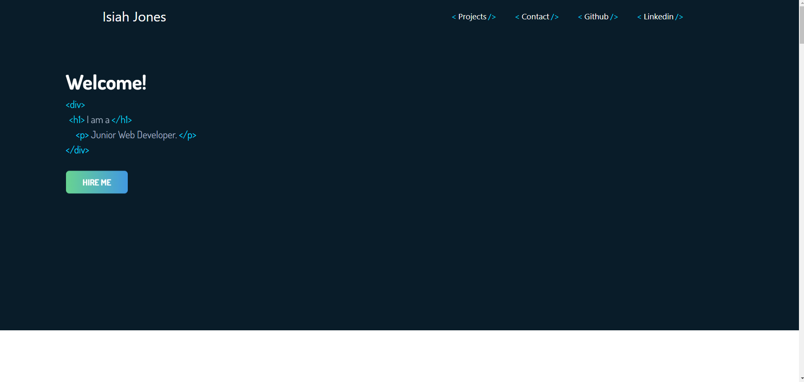
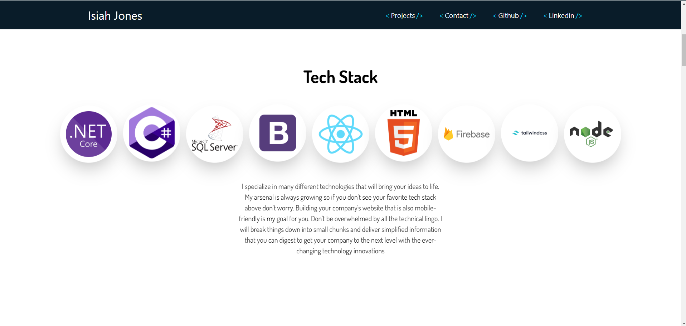
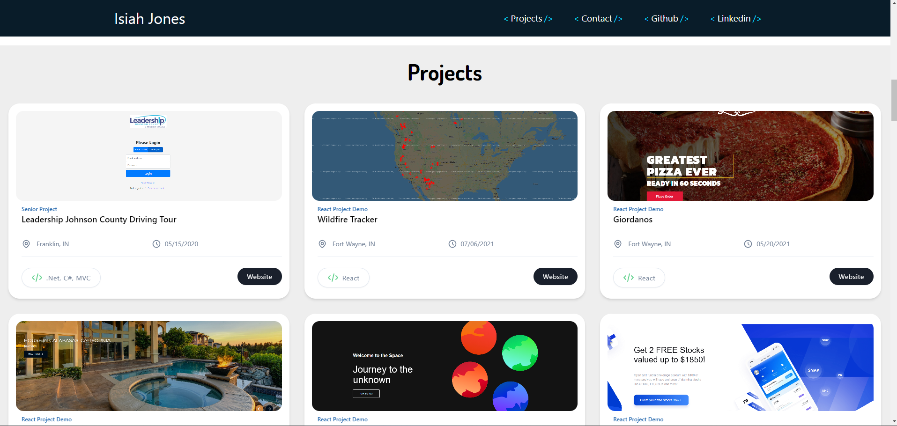

```markdown
# My React Portfolio

Welcome to my React portfolio! This project showcases my skills, projects, and experience using React.js.

```
## Screenshots



```

## Getting Started

To run this project locally, follow these steps:

1. Clone this repository to your local machine:

```
git clone https://github.com/Coder-IsiahJones/react-portfolio.git
```

2. Navigate to the project directory:

```
cd your-react-portfolio
```

3. Install dependencies using Yarn:

```
yarn install
```

4. Run the development server:

```
yarn start
```

This will start the development server and open the application in your default web browser. You can view the website at `http://localhost:3000`.
